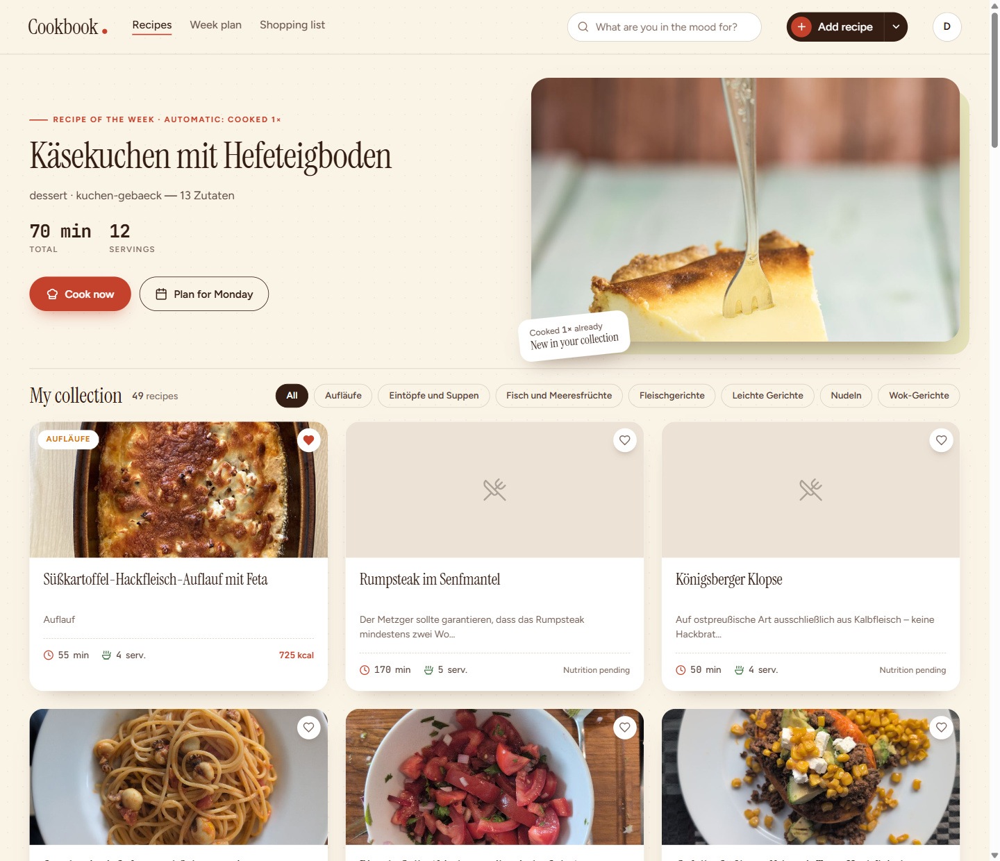
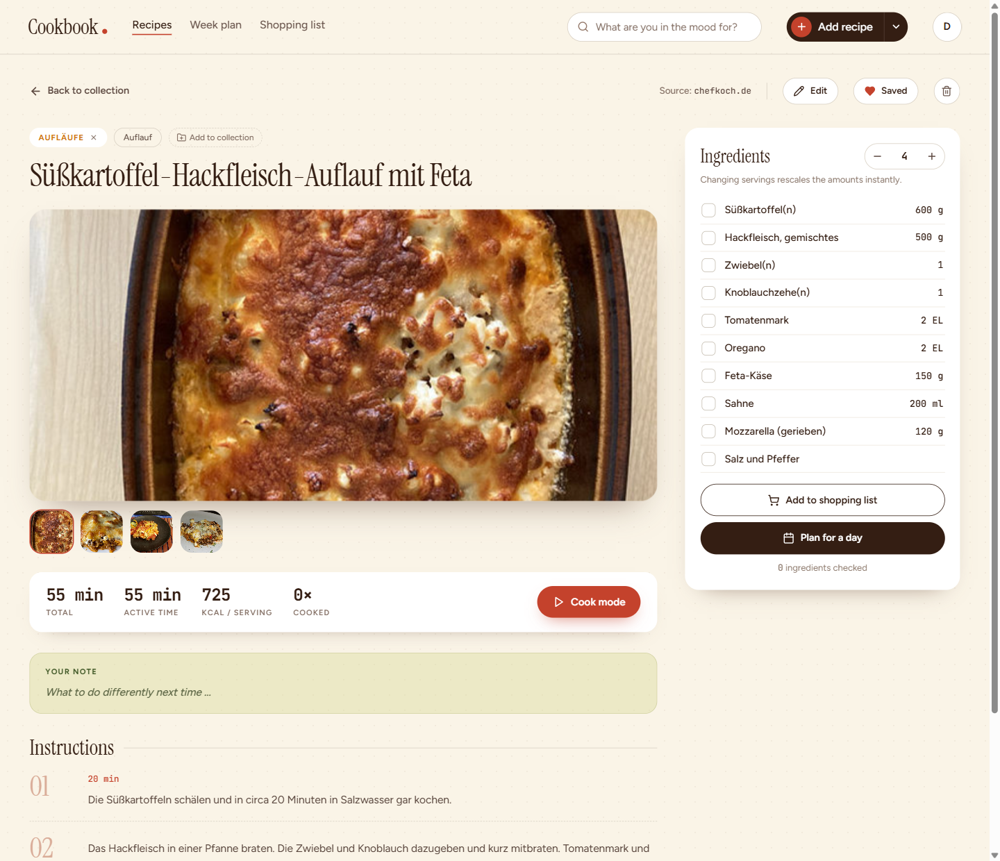
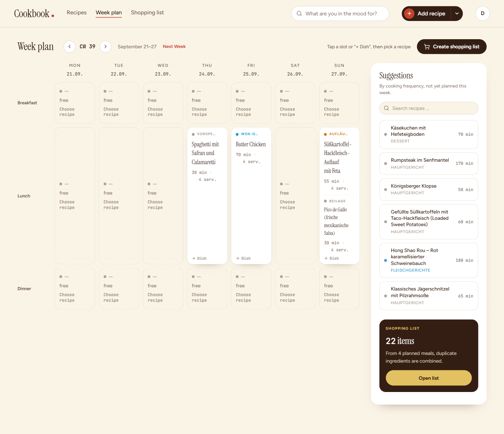
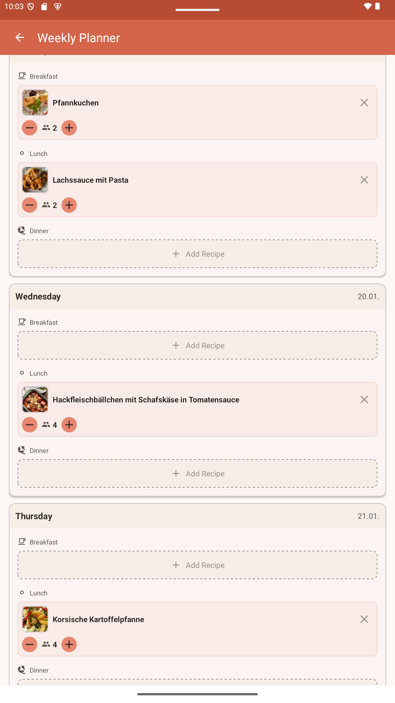
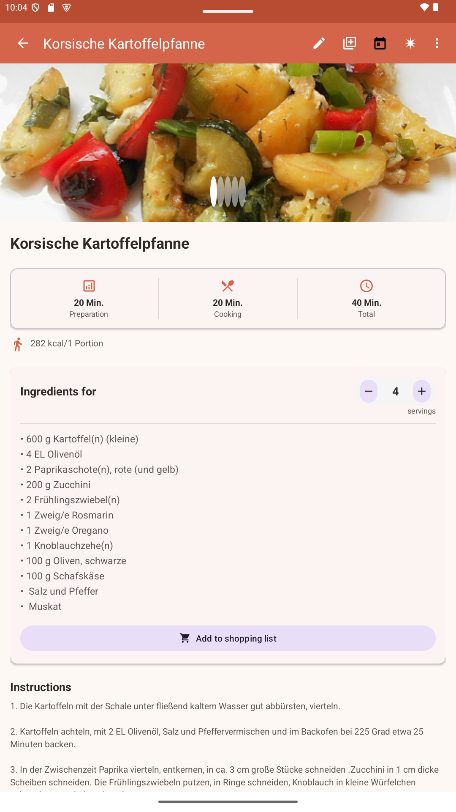
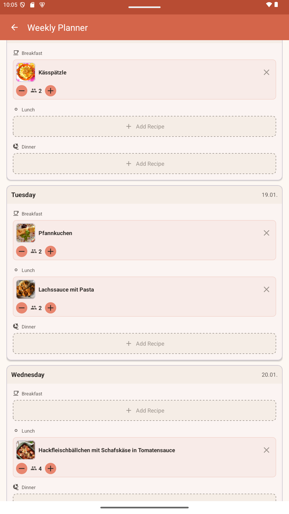

# 📖 Cookbook

**Ad-free recipe management for your own network**

Cookbook is a self-hosted web application for managing cooking recipes. Import recipes from popular recipe sites, organize them in collections, and access them from anywhere – completely ad-free.


## ✨ Features

- 🍳 **Manage Recipes** – Create, edit, and delete recipes with images, ingredients, and preparation steps
- 📥 **Recipe Import** – Import recipes directly from Chefkoch.de, Kochbar.de, and other sites
- 📁 **Collections** – Organize recipes in custom collections (e.g., "Summer Recipes", "Quick Dishes")
- 🏷️ **Categories** – Filter recipes by categories
- 👥 **Serving Calculator** – Automatically adjust ingredient amounts to the desired number of servings
- 📅 **Weekly Planner** – Plan meals for the week (breakfast, lunch, dinner) with automatic ingredient aggregation
- 🛒 **Shopping List** – Export ingredients to Google Keep via Gemini (for individual recipes or the entire weekly plan)
- 🔐 **User Management** – Multi-user support with admin and user roles
- 🔑 **Google SSO** – Sign in with Google account
- 🛡️ **2FA** – Optional two-factor authentication
- 📱 **Responsive Design** – Optimized for desktop, tablet, and smartphone
- 📲 **Android App** – Native Android app as mobile frontend (see [Android App](#-android-app))
- 🤖 **MCP Server** – Create and edit recipes straight from a Claude conversation, signing in with Google (see [MCP Server](#-mcp-server))

## 🖼️ Screenshots

### Web Application

<details>
<summary>Show Web App Screenshots</summary>

#### Recipe Overview
Browse and filter your recipes by categories and collections.



#### Recipe Detail View
View recipe details with images, ingredients (with serving calculator), and step-by-step instructions. Add recipes directly to your weekly planner from here.



#### Weekly Planner
Plan your meals for the entire week with automatic ingredient aggregation.



</details>

### Android App

<details>
<summary>Show Android App Screenshots</summary>

#### Recipe Overview (Mobile)
Browse recipes in a clean, card-based grid layout.



#### Recipe Detail (Mobile)
View full recipe details with serving calculator and quick actions.



#### Weekly Planner (Mobile)
Manage your weekly meal plan with an intuitive day-by-day view.



</details>

## 🚀 Installation

### Prerequisites

- Docker & Docker Compose
- (Optional) Reverse proxy for HTTPS (e.g., Nginx, Traefik, Synology Reverse Proxy)

### Quick Start

1. **Clone repository**
   ```bash
   git clone https://github.com/your-username/cookbook.git
   cd cookbook
   ```

2. **Configure environment variables**
   ```bash
   cp .env.example .env
   # Edit .env and adjust values
   ```

3. **Start containers**
   ```bash
   docker-compose up -d
   ```

4. **Open application**
   - Frontend: http://localhost:3002
   - Default login: `admin` / `admin123`

### Configuration

Create a `.env` file in the project directory:

```env
# Database
POSTGRES_DB=cookbook
POSTGRES_USER=cookbook
POSTGRES_PASSWORD=secure_password_here

# Backend
JWT_SECRET=random_secret_key
NODE_ENV=production

# Ports
FRONTEND_PORT=3002
BACKEND_PORT=4002
POSTGRES_PORT=5435
MCP_PORT=4003

# MCP server (public base URL of this site, no path)
MCP_PUBLIC_URL=https://cookbook.gout-diary.com

# Google OAuth (optional)
GOOGLE_CLIENT_ID=your-google-client-id.apps.googleusercontent.com
```

### Setting up Google SSO (optional)

1. Go to [Google Cloud Console](https://console.cloud.google.com/apis/credentials)
2. Create an OAuth 2.0 Client ID (Web application)
3. Add your domain to "Authorized JavaScript origins"
4. Enter the Client ID in `.env`
5. Create `frontend/.env` with `VITE_GOOGLE_CLIENT_ID=...`

## 🤖 MCP Server

The `mcp/` package exposes the cookbook as an [MCP](https://modelcontextprotocol.io)
server, so recipes can be created, edited, searched, and imported from a Claude
conversation ("add a lentil soup for 4 people", "import this recipe URL",
"double the resting time on the sourdough").

It is reachable at **`https://cookbook.gout-diary.com/mcp`** — the same domain as
the web app, no separate subdomain. You sign in with **your Google account**,
exactly like on the website: Claude opens a sign-in page, you confirm which app
gets access, and every tool call then runs under your own cookbook user with your
own permissions. No shared service account and no API token to configure.

**Run it** (already part of `docker-compose.yml`):

```env
MCP_PORT=4003
MCP_PUBLIC_URL=https://cookbook.gout-diary.com
GOOGLE_CLIENT_ID=your-google-client-id.apps.googleusercontent.com
```

```bash
docker-compose up -d mcp frontend
curl https://cookbook.gout-diary.com/.well-known/oauth-protected-resource/mcp
```

**Connect Claude Code** — no token, the browser handles the login:

```bash
claude mcp add --scope user --transport http cookbook https://cookbook.gout-diary.com/mcp
```

Running it locally over stdio instead, the available tools, and the security
notes are documented in [mcp/README.md](mcp/README.md).

## 🏗️ Architecture

```
cookbook/
├── frontend/          # React + Vite + TypeScript (built, served by nginx)
│   ├── nginx.conf           # Production serving + /api and /mcp routing
│   ├── src/
│   │   ├── app/
│   │   │   ├── components/   # UI components
│   │   │   │   ├── WeeklyPlanner.tsx      # Weekly planner
│   │   │   │   ├── RecipeSearchDialog.tsx # Recipe search dialog
│   │   │   │   └── ...
│   │   │   ├── services/     # API client
│   │   │   ├── types/        # TypeScript types
│   │   │   │   ├── recipe.ts
│   │   │   │   ├── mealplan.ts  # Weekly planner types
│   │   │   │   └── user.ts
│   │   │   └── utils/        # Utility functions
│   │   └── main.tsx
│   └── package.json
│
├── backend/           # Node.js + Express + TypeScript
│   ├── src/
│   │   ├── routes/          # API endpoints
│   │   ├── middleware/      # Auth middleware
│   │   └── index.ts
│   ├── prisma/
│   │   └── schema.prisma    # Database schema
│   └── package.json
│
├── mcp/               # MCP server (Claude integration)
│   ├── src/
│   │   ├── api/             # REST client for the cookbook API
│   │   ├── oauth/           # OAuth server, Google sign-in page, session store
│   │   ├── tools/           # MCP tools (recipes, catalog, import)
│   │   ├── transport/       # stdio and streamable HTTP
│   │   └── index.ts
│   └── package.json
│
├── docker-compose.yml
└── .env
```

### Tech Stack

| Component | Technology |
|-----------|------------|
| Frontend | React 18, Vite, TypeScript, Tailwind CSS, shadcn/ui |
| Serving | nginx (static build + reverse proxy to backend and MCP server) |
| Backend | Node.js, Express, TypeScript, Prisma ORM, Sharp (image processing) |
| Database | PostgreSQL 16 |
| MCP Server | Node.js, @modelcontextprotocol/sdk, Zod, Express, OAuth 2.1 + PKCE |
| Auth | JWT, bcrypt, Google OAuth 2.0, TOTP (2FA) |
| Container | Docker, Docker Compose |
| Mobile | Kotlin, Jetpack, Retrofit, Material Design 3 |

## 📅 Weekly Planner

The weekly planner allows you to plan meals for an entire week:

**Features:**
- 📆 Calendar view of a week (Monday to Sunday)
- 🍽️ Three meals per day (breakfast, lunch, dinner)
- 🔍 Recipe selection with full-text search, category and collection filter
- 👥 Individual serving specification per meal
- 🧮 Automatic ingredient aggregation (same ingredients are summed up)
- 🛒 Export the entire shopping list to Gemini/Google Keep

**How to use the weekly planner:**
1. Click on "Weekly Planner" in the header
2. Select the desired week (default: coming week)
3. Click on a meal slot and select a recipe
4. Adjust the serving count with +/-
5. Click "Create shopping list" to send all ingredients to Gemini

## 📲 Android App

A native Android app is available as a mobile frontend. The source code is located in the separate repository/folder `cookbookApp`.

**Android App Features:**
- 📱 Native Android experience
- 🔐 Login with username/password or Google SSO
- 📖 Browse, view, and edit recipes
- 📷 Take photos directly with the camera or add from gallery
- 👥 Serving calculator with automatic amount calculation
- 📁 Manage collections
- 🛒 Send ingredients to Gemini
- 🔄 Automatic network detection (internal/external)

**Technology:**
- Kotlin
- Jetpack Components (ViewModel, Navigation)
- Retrofit + OkHttp
- Coil for image processing
- Material Design 3

## 📥 Recipe Import

Cookbook can automatically import recipes from various websites:

| Website | Status |
|---------|--------|
| Chefkoch.de | ✅ Full support |
| Kochbar.de | ✅ Full support |
| Others (JSON-LD) | ✅ Automatic |

The import uses structured data (JSON-LD/schema.org) and HTML parsing as fallback.

**How to import a recipe:**
1. Click on "Import Recipe"
2. Paste the recipe URL
3. The recipe will be imported with images, ingredients, and instructions

## 🔧 Development

### Local Development

```bash
# Backend
cd backend
npm install
npm run dev

# Frontend (new terminal)
cd frontend
npm install
npm run dev
```

### With Docker (recommended)

```bash
docker-compose up
```

The application uses volume mounts and hot-reloading – code changes are applied immediately.

## 📝 API Documentation

### Authentication

| Endpoint | Method | Description |
|----------|--------|-------------|
| `/api/auth/login` | POST | Login with username/password |
| `/api/auth/google` | POST | Login with Google |
| `/api/auth/me` | GET | Current user |
| `/api/auth/change-password` | POST | Change password |
| `/api/auth/2fa/setup` | POST | Set up 2FA |
| `/api/auth/2fa/verify` | POST | Verify 2FA |
| `/api/auth/2fa/disable` | POST | Disable 2FA |

### Recipes

| Endpoint | Method | Description |
|----------|--------|-------------|
| `/api/recipes` | GET | All recipes (with filter & pagination) |
| `/api/recipes/:id` | GET | Single recipe |
| `/api/recipes` | POST | Create recipe |
| `/api/recipes/:id` | PUT | Edit recipe |
| `/api/recipes/:id` | DELETE | Delete recipe |
| `/api/import` | POST | Import recipe from URL |

**Query parameters for `/api/recipes`:**

| Parameter | Type | Description |
|-----------|------|-------------|
| `category` | string | Filter by category |
| `collection` | string | Filter by collection ID |
| `search` | string | Full-text search in title |
| `full` | boolean | `true` = complete recipe data (Web), `false` = thumbnails + basic info (Mobile) |
| `limit` | number | Number of recipes per page (only without `full=true`, max. 100) |
| `offset` | number | Offset for pagination (only without `full=true`) |

**Response formats:**

With `full=true` (Web app):
```json
[
  { "id": "...", "title": "...", "ingredients": [...], "instructions": "...", ... }
]
```

Without `full=true` (Mobile app, paginated):
```json
{
  "items": [{ "id": "...", "title": "...", "thumbnail": "...", ... }],
  "total": 42,
  "limit": 20,
  "offset": 0,
  "hasMore": true
}
```

### Collections & Categories

| Endpoint | Method | Description |
|----------|--------|-------------|
| `/api/collections` | GET/POST | Collections |
| `/api/collections/:id/recipes/:recipeId` | POST/DELETE | Recipe to collection |
| `/api/categories` | GET/POST/DELETE | Categories |

## 🤝 Contributing

Contributions are welcome! Please create a fork and a pull request.

1. Create a fork
2. Create a feature branch (`git checkout -b feature/new-feature`)
3. Commit changes (`git commit -m 'Added new feature'`)
4. Push branch (`git push origin feature/new-feature`)
5. Create pull request

## 📄 License

MIT License – see [LICENSE](LICENSE) for details.

## 🙏 Acknowledgments

- [shadcn/ui](https://ui.shadcn.com/) – UI components
- [Prisma](https://www.prisma.io/) – Database ORM
- [Lucide](https://lucide.dev/) – Icons
- [Sharp](https://sharp.pixelplumbing.com/) – Image processing & thumbnails
- [Retrofit](https://square.github.io/retrofit/) – HTTP client for Android

---

**Made with ❤️ for home cooks who value privacy**
